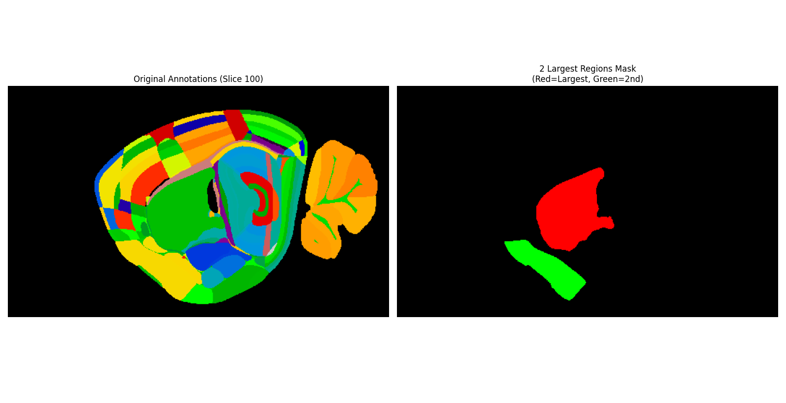

# LSFM Segmentations



This repository provides tools for mouse brain segmentation and visualization using U-Net architecture. It includes functionalities for dataset preparation, model training, evaluation, and visualization of segmentation results.

## Features

- **Dataset Preparation**: Generate training and testing datasets from 3D brain data.
- **Model Training**: Train U-Net models for segmentation tasks.
- **Evaluation**: Evaluate segmentation results using metrics like IoU, F1 score, and confusion matrix.
- **Visualization**: Visualize brain slices, annotations, and segmentation overlays.
- **Export**: Save annotated images and segmentation results as PNG files.

## Project Structure

```
├── config.py                # Configuration loader for YAML settings
├── config.yaml              # Configuration file with dataset paths and hyperparameters
├── dataset.py               # Dataset creation and preprocessing utilities
├── dataset_validation.ipynb # Notebook for dataset exploration and validation
├── evaluate_and_export.ipynb # Notebook for model evaluation and export
├── mus_brain_data_mining.ipynb # Notebook for visualization and data mining
├── README.md                # Project documentation
├── requirements.txt         # Python dependencies
├── train_and_save.py        # Script for training and saving U-Net models
├── u_net.py                 # U-Net model implementation
```

## Installation

1. Clone the repository:
   ```bash
   git clone https://github.com/your-repo/LSFM_Segmentations.git
   cd LSFM_Segmentations
   ```

2. Set up a virtual environment:
   ```bash
   python3 -m venv .venv
   source .venv/bin/activate
   ```

3. Install dependencies:
   ```bash
   pip install -r requirements.txt
   ```

4. Install Jupyter kernel:
   ```bash
   python3 -m ipykernel install --user --name=mus_brain
   ```

## Usage

### Dataset Preparation

Use the `generate_complete_dataset` function in [`dataset.py`](dataset.py) to create training and testing datasets from NIfTI files.

### Model Training

Run [`train_and_save.py`](train_and_save.py) to train a U-Net model:
```bash
python train_and_save.py --model_name unet_model --output_path ./trained_models
```

### Evaluation

Use [`evaluate_and_export.ipynb`](evaluate_and_export.ipynb) to evaluate the trained model and compute metrics like IoU and F1 score.

### Visualization

Use [`mus_brain_data_mining.ipynb`](mus_brain_data_mining.ipynb) to visualize brain slices, annotations, and segmentation overlays.

### Dataset Validation

Use [`dataset_validation.ipynb`](dataset_validation.ipynb) to explore and validate the dataset.

## Configuration

Modify [`config.yaml`](config.yaml) to set dataset paths and hyperparameters:
```yaml
dataset:
  train:
    image: "/path/to/train/images"
    mask: "/path/to/train/masks"
  test:
    image: "/path/to/test/images"
    mask: "/path/to/test/masks"
seed: 42
output_size: 128
batch_size: 8
epochs: 10
lr: 0.001
```

## Dependencies

See [`requirements.txt`](requirements.txt) for a list of required Python packages.

## License

This project is licensed under the MIT License.

## Acknowledgments

- U-Net architecture reference: [https://arxiv.org/pdf/1505.04597](https://arxiv.org/pdf/1505.04597)
- Libraries used: PyTorch, NumPy, Matplotlib, scikit-image, scikit-learn

Feel free to contribute or raise issues for improvements!